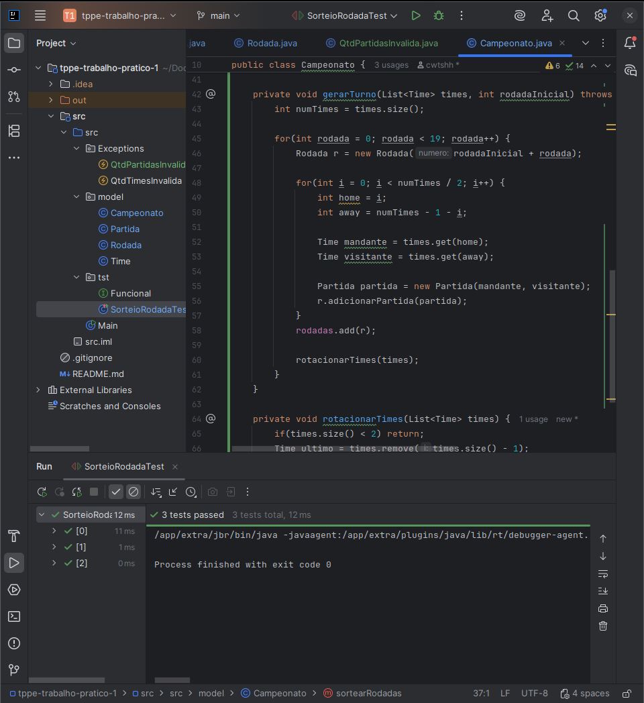

# Trabalho Prático — Técnicas de Programação para Plataformas Emergentes

**FCTE** – Faculdade de Ciências e Tecnologias em Engenharias

**Disciplina:** Técnicas de Programação para Plataformas Emergentes (TPPE)

**Projeto:** Sistema de Simulação e Classificação — Campeonato Brasileiro Série A 2025

## Contribuidores 

<table>
  <tr>
    <td align="center"><a href="https://github.com/Angelicahaas"><br /><sub><b>Harleny Angéllica</b></sub></a><br />   
    <td align="center"><a href="https://github.com/cwtshh "><br /><sub><b>Gustavo Costa</b></sub></a><br />
    <td align="center"><a href="https://github.com/IderlanJ"><br /><sub><b>Iderlan Júnio</b></sub></a><br />
  </tr>
</table>  

  ## 1. Introdução
Neste trabalho desenvolvemos uma aplicação para simular o Campeonato Brasileiro Série A de 2025, com geração das rodadas, registro dos resultados e cálculo da classificação a cada rodada.

O desenvolvimento foi feito seguindo as três etapas exigidas pelo enunciado: **Test-Driven Development (TDD), Refactoring e Design by Contracts (DbC)**. A etapa inicial — TDD — guiou a criação dos comportamentos desejados através de testes automatizados; apresentamos nesta documentação evidências (prints) dos testes em execução e dos resultados obtidos.

## 2. Arquitetura e Estrutura do Repositório

A seguir, apresentamos a estrutura real do projeto implementado em **Java**.  
Essa organização reflete a separação entre código-fonte principal (`src`), testes (`tst`) e classes de exceção (`Exceptions`).

```bash
tppe-trabalho-pratico-1
└─ src/
  └─ src/
     ├─ Exceptions/
     │  ├─ QtdPartidasInvalida.java
     │  └─ QtdTimesInvalida.java
     │
     ├─ model/
     │  ├─ Campeonato.java
     │  ├─ Partida.java
     │  ├─ Rodada.java
     │  ├─ TabelaClassificacao.java
     │  └─ Time.java
     │
     ├─ tst/
     │  ├─ AllTests.java
     │  ├─ CalculoEstatisticasTest.java
     │  ├─ CalculoPontuacaoTest.java
     │  ├─ CampeonatoConstrutorExceptionTest.java
     │  ├─ CampeonatoExceptionTest.java
     │  ├─ CampeonatoSortearRodadaTest.java
     │  ├─ CriterioDesempateTest.java
     │  ├─ Excecao.java
     │  ├─ ExceptionTests.java
     │  ├─ Funcional.java
     │  ├─ FuncionalTests.java
     │  ├─ RodadaExceptionTest.java
     │  ├─ SorteioRodadaTest.java
     │  └─ ValidacaoJogosTest.java
     │
     └─ Main.java
  └─ src.iml
└─ .gitgnore
└─ README.md
└─ tppe-trabalho-pratico-1.iml
```

## 3. Explicação do TDD passo a passo

### 1. Escrever o primeiro teste falhando

Precisamos garantir que o teste `SorteioRodadaTest` falhe inicialmente ao apontar a ausência de um método na classe `Campeonato`.

Este teste verifica se o sorteio gera o número correto de rodadas para a quantidade de times, o que força a criação da API pública `sortearRodadas()` e o armazenamento das rodadas no domínio.


---

### 2. Implementar o código mínimo para o teste passar

Em seguida, implementamos o mínimo necessário para fazer o teste passar, priorizando correção antes de qualquer otimização. Com isso, conseguimos fazer o teste passar atualizando a classe `Campeonato`.

A lógica introduzida cria as 38 rodadas para 20 times, evitando duplicidade de confrontos por rodada e expondo os métodos necessários em `Campeonato` para consumo pelos testes.



---

### 3. Refatorar o código

Com os testes passando, realiza-se a refatoração para melhorar o código deixando-o mais forte e refatoramos os testes para parametrizados, mantendo o comportamento e sem alterar os resultados esperados.

Você pode ver o código aqui: [Ver código do SorteioRodada](./src/src/tst/SorteioRodadaTest.java)

> **Fizemos este passo a passo para todos os testes apresentados no projeto.**


## Considerações finais

Com base na metodologia de **TDD**, fizemos as seguintes etapas:

- Escrevemos os testes automatizados para cada funcionalidade.
- Desenvolvemos as classes e métodos que os testes pediam.
- Rodamos os testes e confirmamos que tudo estava funcionando.
- Quando os testes passaram, fizemos melhorias no código sem perder o que já estava certo.
- Aplicamos as etapas finais, terminando a aplicação com qualidade e teste robustos.

Além disso, ultilizamos:

- Categorias de testes, organizando os casos por tipo e objetivo.
- Testes parametrizados para checar várias situações diferentes com o mesmo teste.
- **Suítes de testes funcionais**, que verificam se o sistema faz corretamente o que deveria nas situações comuns de uso.
- **Suítes de testes de exceção**, que testam como o sistema reage diante de algum erro ou situação inesperada, garantindo que ele não quebre e trate os erros de forma adequada.
- **Suítes de teste (AllTests)**, que executam todos de uma vez só (Funcionais e de Exceção) e mostram se todo o sistema está funcionando .

Essas práticas fizeram com que o nosso sistema funcionasse com qualidade, e que aprendessemos mais sobre as tecnicas de desenvolvimento.
